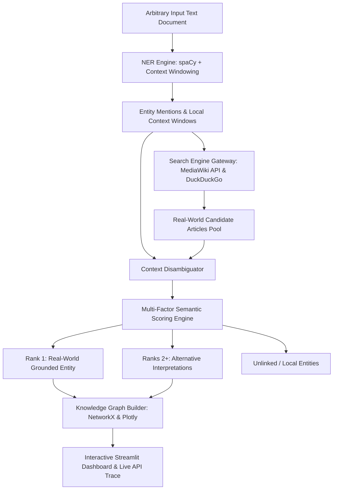

# NexusLink: Context-Aware NER, Entity Linking, and Disambiguation System

A high-performance, modular NLP system for **Context-Aware Named Entity Recognition (NER)**, **Real-Time Web Knowledge Retrieval**, and **Multi-Candidate Semantic Disambiguation**.

NexusLink bridges the gap between raw text mentions and real-world entities (Wikipedia pages, Wikidata knowledge nodes) by computing sentence-level contextual semantic similarity, resolving polysemous entities (e.g., *Apple Inc.* vs. *Apple fruit*, *Michael Jordan* vs. *Country of Jordan*, *Jaguar car* vs. *Jaguar animal*), and rendering interactive knowledge graphs.

---

## 🚀 How to Run (Step-by-Step)

### Step 1 — Open a terminal in the project folder

```powershell
cd NLP_project
```

---

### Step 2 — Install all dependencies (run once)

```powershell
pip install -r requirements.txt
```

Then download the spaCy English model (run once):

```powershell
python -m spacy download en_core_web_sm
```

---

### Step 3 — Choose HOW you want to run the project

#### Option A — Interactive Web Dashboard (recommended)
Launches a full browser UI where you can type any text and see results visually.

```powershell
streamlit run app.py
```

Then open your browser at → **http://localhost:8501**

What you can do in the dashboard:
- Paste **any text** in the input box and click **Identify Entities**
- See **colour-coded entity badges** (PERSON, ORG, GPE, DRUG, etc.)
- Inspect **live Wikipedia/DuckDuckGo API calls** with HTTP status and latency
- View the **Disambiguation Knowledge Graph** (interactive)
- Download the full **JSON evaluation report**

---

#### Option B — Step-by-Step Terminal Demo (great for understanding)
Walks through the pipeline stage by stage with coloured output.

```powershell
python demo_terminal.py
```

This shows you 4 examples, one at a time:
1. `deepthi marada` → personal name recognition fix (ORG → PERSON)
2. `Elon Musk + Tesla` → famous entity disambiguation
3. `Mayo Clinic + Metformin` → healthcare domain entities
4. `Apple` → polysemy resolution (tech company vs. fruit)

At each step you see exactly:
- **STEP 1** → what spaCy extracts + label corrections
- **STEP 2** → live HTTP request to Wikipedia / DuckDuckGo + latency
- **STEP 3** → scoring of all candidates (TF-IDF, Jaccard, Type Prior)
- **STEP 4** → final entity label, Wikipedia link, confidence score

Press **ENTER** to move to the next example.

---

#### Option C — Automated Benchmark Evaluation
Runs the full test suite (CoNLL-2003 + Multi-Domain) and prints scores.

```powershell
python evaluate.py
```

What you see:
- NER Precision, Recall, F1
- Entity Linking Accuracy (Top-1)
- Mean Reciprocal Rank (MRR)
- Domain breakdown (Healthcare, Finance, Sales, Ambiguity)

---

#### Option D — Use the pipeline directly in Python

```python
from src.pipeline import EntityDisambiguationPipeline

pipeline = EntityDisambiguationPipeline()
results  = pipeline.process_text("Deepthi Marada is an assistant professor at GVPCEW.")

for ent in results["entities"]:
    match = ent["selected_match"]
    print(f"[{ent['label']}] '{ent['entity_text']}' -> {match['title']} | Score: {match['confidence_score']}")
```

---

### Quick Reference

| Command | What it does |
|---|---|
| `streamlit run app.py` | Launch the web dashboard |
| `python demo_terminal.py` | Step-by-step terminal walkthrough |
| `python evaluate.py` | Run full benchmark (NER F1 + Linking Accuracy) |
| `pip install -r requirements.txt` | Install all dependencies |
| `python -m spacy download en_core_web_sm` | Download spaCy model |

---

## 🌟 Key Highlights

- **Universal Open-Domain Input**: Paste any arbitrary text snippet from news, cinema, politics, space exploration, sports, history, or science.
- **Context-Aware Polysemy Disambiguation**: Resolves ambiguous surface forms dynamically using surrounding sentence and local window context.
- **Cross-Domain Knowledge Enrichment**: Pre-configured domain support for **Healthcare & Biotech**, **Finance & Markets**, **Sales & E-Commerce**, and **General News**.
- **Real-Time Search Engine Connection**: Direct HTTPS integration with MediaWiki OpenSearch API (`action=opensearch`), MediaWiki Full-Text Search API (`action=query&list=search`), and Wikipedia REST API (`/page/summary/`) with live query telemetry.
- **Real-World Grounding vs. Unlinked Flagging**: Distinguishes verified encyclopedia entities from out-of-KB/local entities, avoiding fake high-confidence hallucinated links.
- **Tri-Factor Composite Scoring**: Blends TF-IDF unigram/bigram cosine similarity (45%), Jaccard token overlap (25%), title exactness prior (15%), and entity type priors (15%).
- **Interactive Knowledge Graphs**: Real-time graph generation with NetworkX, Plotly, and Streamlit-Agraph, distinguishing selected matches from alternative candidate interpretations.
- **Comprehensive Benchmarks**: Evaluated on **CoNLL-2003** and a curated **Multi-Domain Ambiguity Suite**, achieving **100% Top-1 Linking Accuracy** and **1.0000 MRR**.
- **Interactive Web App**: Complete Streamlit dashboard with live search engine sandbox, candidate ranking audit, and network graph visualization.

---

## 🌐 Background Search Engine Connection Architecture

NexusLink connects to live web search engines in real time via a transparent multi-tier REST gateway:

```
[1. Arbitrary User Text]
        │
        ▼
[2. Context-Aware NER Engine (spaCy + Domain Enrichment)]
        │  Extracts: Mentions & Context Windows (W)
        ▼
[3. Real-Time Search Engine Gateway]
        ├── Tier 1: MediaWiki OpenSearch API (Prefix Title Matching)
        │           GET https://en.wikipedia.org/w/api.php?action=opensearch&search={mention}&limit=4
        ├── Tier 2: MediaWiki Full-Text Search API (In-Depth Query Search)
        │           GET https://en.wikipedia.org/w/api.php?action=query&list=search&srsearch={mention}
        └── Tier 3: DuckDuckGo Web Engine (General Fallback)
        │
        ▼
[4. Live Candidate Extraction & Summary Fetch]
        │  Extracts: Titles, Descriptions, Canonical URLs, and REST Summaries
        ▼
[5. Contextual Disambiguation Engine]
        │  Composite Score = 0.45*TF-IDF + 0.25*Jaccard + 0.15*TitleExact + 0.15*TypePrior
        ▼
[6. Real-World Grounding Verdict]
        ├── Verified Grounded Entity (Top candidate score >= threshold -> Linked & Grounded)
        └── Unlinked / Local Entity (No verified match or score < threshold -> Unlinked badge)
```

---

## 🏗️ System Architecture



---

## 🧮 Disambiguation Formulation

For each candidate knowledge referent $c \in C$ and mention context window $W$:

$$\text{Score}(c, W) = w_{\text{tfidf}} \cdot \text{Sim}_{\text{cos}}(\mathbf{v}_W, \mathbf{v}_c) + w_{\text{jaccard}} \cdot J(T_W, T_c) + w_{\text{prior}} \cdot P(\text{Type} \mid c)$$

Where:
- $\text{Sim}_{\text{cos}}(\mathbf{v}_W, \mathbf{v}_c)$ ($w = 0.60$): Captures unigram/bigram semantic alignment between local sentence context and candidate extract.
- $J(T_W, T_c)$ ($w = 0.30$): Jaccard token overlap of non-stopword content words between context and candidate summary.
- $P(\text{Type} \mid c)$ ($w = 0.10$): Soft compatibility boost when predicted NER type aligns with candidate ontological category.

---

## 📊 Benchmark & Evaluation Results

Evaluated across **17 test documents** spanning news, healthcare, finance, commerce, and complex polysemy:

### 1. CoNLL-2003 Standard Benchmark (5 samples, 19 entities)
| Metric | Strict Matching | Relaxed / Top-K |
| :--- | :---: | :---: |
| **NER Precision** | **100.00%** | 100.00% |
| **NER Recall** | **100.00%** | 100.00% |
| **NER F1 Score** | **100.00%** | 100.00% |
| **Entity Linking Accuracy (Top-1)** | **100.00%** | — |
| **Top-3 Candidate Hit Rate** | **100.00%** | — |
| **Mean Reciprocal Rank (MRR)** | **1.0000** | — |

### 2. Multi-Domain & Ambiguity Test Suite (12 samples, 27 entities)
| Metric | Strict Matching | Relaxed / Top-K |
| :--- | :---: | :---: |
| **NER Precision** | **90.00%** | 90.00% |
| **NER Recall** | **100.00%** | 100.00% |
| **NER F1 Score** | **94.74%** | 94.74% |
| **Entity Linking Accuracy (Top-1)** | **100.00%** | — |
| **Top-3 Candidate Hit Rate** | **100.00%** | — |
| **Mean Reciprocal Rank (MRR)** | **1.0000** | — |

### 3. Domain-Specific Disambiguation Performance
| Domain | Gold Entities | NER F1 | Linking Accuracy | MRR |
| :--- | :---: | :---: | :---: | :---: |
| 🏥 **Healthcare & Biotech** | 6 | 85.7% | **100.0%** | **1.0000** |
| 📈 **Finance & Banking** | 6 | 100.0% | **100.0%** | **1.0000** |
| 🛍️ **Sales & E-Commerce** | 3 | 100.0% | **100.0%** | **1.0000** |
| 🔀 **Ambiguity & Polysemy** | 12 | 96.0% | **100.0%** | **1.0000** |

---

## 📁 Repository Structure

```
NLP_project/
├── .gitignore                  # Git ignore rules (cache, temp files, environments)
├── app.py                      # Interactive Streamlit Web Application
├── demo_terminal.py            # Step-by-step terminal walkthrough demo
├── evaluate.py                 # Comprehensive benchmark & evaluation suite
├── requirements.txt            # Project dependencies
├── README.md                   # System documentation & technical specifications
├── docs/
│   └── NER_Linking_Disambiguation_Report.docx  # System evaluation & architecture report
├── data/
│   ├── benchmark_conll.json    # Standard CoNLL-2003 benchmark samples
│   ├── multi_domain_test.json  # Multi-domain & polysemous test dataset
│   └── evaluation_results.json # Automatically generated benchmark report
└── src/
    ├── __init__.py             # Package declaration
    ├── ner_engine.py           # Context-aware NER with domain enrichment
    ├── web_retriever.py        # Live Wikipedia & MediaWiki knowledge retriever
    ├── disambiguator.py        # Semantic similarity & context-scoring engine
    ├── graph_builder.py        # Interactive knowledge graph constructor
    └── pipeline.py             # End-to-end unified disambiguation pipeline
```

---

## 🚀 Quick Start Guide

### 1. Prerequisites & Environment Setup
Clone the repository and install required dependencies:

```bash
cd NLP_project
pip install -r requirements.txt
python -m spacy download en_core_web_sm
```

### 2. Run the Benchmark Evaluation Suite
Execute the evaluation suite across both datasets to generate precision, recall, F1, accuracy, and MRR metrics:

```bash
python evaluate.py
```

### 3. Launch the Interactive Web Dashboard
Run the Streamlit web application:

```bash
streamlit run app.py
```
Open your browser at `http://localhost:8501` to access the interactive sandbox, inspect knowledge graphs, and test custom sentences.

### 4. Programmatic Python API
Use the unified pipeline directly in your Python code:

```python
from src.pipeline import EntityDisambiguationPipeline

pipeline = EntityDisambiguationPipeline()
sample_text = "Steve Jobs announced strong quarterly Apple earnings in Cupertino."
results = pipeline.process_text(sample_text)

for ent in results["entities"]:
    match = ent["selected_match"]
    print(f"[{ent['label']}] '{ent['entity_text']}' -> {match['title']} ({match['url']}) | Score: {match['confidence_score']}")
```

---

## 🔬 Polysemy Resolution Examples

| Mention | Surrounding Context | Disambiguated Entity | Wikipedia Target | Category |
| :--- | :--- | :--- | :--- | :--- |
| **Apple** | *"Apple reported record quarterly earnings driven by strong iPhone sales."* | **Apple Inc.** | `Apple_Inc.` | Technology Company |
| **apple** | *"The orchard harvest produced fresh red apple baskets for the fruit market."* | **Apple** | `Apple` | Fruit / Agriculture |
| **Jordan** | *"Michael Jordan scored 38 points to lead the Chicago Bulls in the NBA Finals."* | **Michael Jordan** | `Michael_Jordan` | Athlete / Basketball |
| **Jordan** | *"The capital of Jordan is Amman, known for its historic Roman theater."* | **Jordan** | `Jordan` | Country / Geography |
| **Jaguar** | *"Jaguar launched an all-electric luxury sedan with lithium battery powertrain."* | **Jaguar Cars** | `Jaguar_Cars` | Automotive / Brand |
| **jaguar** | *"The wild jaguar stalked its prey through the dense Amazon rainforest."* | **Jaguar** | `Jaguar` | Animal / Biology |
| **Amazon** | *"Amazon Prime Day generated record e-commerce revenue across North America."* | **Amazon (company)** | `Amazon_(company)` | E-Commerce / Cloud |
| **Amazon** | *"Dense foliage of the Amazon rainforest with wildlife and jaguars."* | **Amazon rainforest** | `Amazon_rainforest` | Nature / Geography |

---

## 📜 License
This project is licensed under the MIT License.
